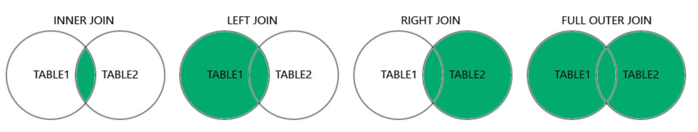

# Queries

#### **SELECT**: used to select data from a database
* ```sql
  SELECT * FROM table_name;
  ```

#### **DISTINCT**: filters duplicates
* ```sql
  SELECT DISTINCT column_name
  ```

#### **ORDER BY**: used to sort results in ascending or descending order
* ```sql
  SELECT * 
  FROM table_name 
  ORDER BY column DESC;
  ```
* ```sql
  SELECT * 
  FROM table_name 
  ORDER BY column1 ASC, column2 DESC;
  ```

#### **WHERE**: used for filtering records
* ```sql
  SELECT column1, column2 
  FROM table_name 
  WHERE condition;
  ```
* ```sql
  SELECT * 
  FROM table_name 
  WHERE EXISTS (SELECT column_name 
  				FROM table_name 
				WHERE condition);
  ```

#### **LIKE**: operator used in a WHERE clause to search for a pattern within a column
* ```sql
  SELECT column 
  FROM table_name 
  WHERE column_name LIKE pattern;
  ```
* Find values that start with "a"
  * ```sql
    LIKE 'a%'
    ```
* Find values that start end with "a"
  * ```sql
    LIKE '%a'
    ```
* Find values that contain "ab"
  * ```sql
    LIKE '%ab%'
    ```

#### **IN**: operator used to specify multiple values in a WHERE clause
* ```sql
  SELECT columns 
  FROM table_name 
  WHERE column_name IN (value1, value2, ...);
  ```

#### **BETWEEN**: operator used to select values within a given range
* ```sql
  SELECT columns 
  FROM table_name 
  WHERE column_name BETWEEN value1 AND value2;
  ```
* ```sql
  SELECT columns 
  FROM table_name 
  WHERE (column_name BETWEEN value1 AND value2) AND NOT column_name2 IN (value3, value4);
  ```

#### **JOIN**: clause used to combine rows from two or more tables, based on a related column between them


* ##### **INNER JOIN**: returns records that have matching values in both tables
	* ```sql
		SELECT u.user_id 
		FROM users u 
		JOIN posts p 
			ON u.user_id = p.user_id;
	  ```

* ##### **LEFT JOIN**: returns all records from the left table, and the matched records from the right table
	* ```sql
		SELECT COUNT(DISTINCT 
						CASE WHEN p.post_id IS NOT NULL THEN u.user_id
					END) / COUNT(*) AS pct_users
		FROM users u 
		LEFT JOIN posts p 
			ON u.user_id = p.user_id;
	  ```

* ##### **RIGHT JOIN**: returns all records from the right table, and the matched records from the left table
	* ```sql
		SELECT COUNT(DISTINCT 
						CASE WHEN u.country = 'US' THEN p.post_id
					END) / COUNT(*) AS pct_users
		FROM users u 
		RIGHT JOIN posts p 
			ON u.user_id = p.user_id;
	  ```

* ##### **OUTER JOIN**: returns all records when there is a match in either left or right table
	* ```sql
		SELECT *
		FROM users u
		OUTER JOIN posts p
			ON u.user_id = p.user_id
		WHERE u.active_status = False OR p.active_status = False;
	  ```

#### **PARTITION BY**: window function that separates rows into different partitions
* ```sql
  SELECT *,
		 SUM(posts) OVER (PARTITION BY user_id) AS post_count
  FROM users u
  LEFT JOIN posts p
	ON u.user_id = p.user_id
  ```

#### **RANK**: window function that assigns a rank to each row based on a provided column
* ```sql
  SELECT *,
		 RANK() OVER (PARTITION BY user_id
		 			  ORDER BY LENGTH(body) DESC) AS rank
  FROM users u
  LEFT JOIN posts p
	ON u.user_id = p.user_id
  ```